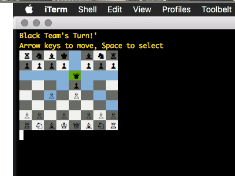

# Chess

This is a command line implementation of Chess written in Ruby. The visual formatting may not render properly on non-Mac machines. I build move-trees for each piece based on the current configuration of the board, and highlight the available moves for each piece when it is selected. I perform a deep-dup on the board to test for checkmate. I also use a null-object for empty squares, making errors more informative and debugging more efficient.

To play, simply download this repo, run `bundle install`, and run `ruby game.rb`

# Screenshot

This screenshot shows the visual appeal of the game and demonstrates the available-move-highlighting feature.

# To-Do's

- [ ] Refactor
- [ ] Allow for deselecting pieces
- [ ] Enforce current player move restrictions
